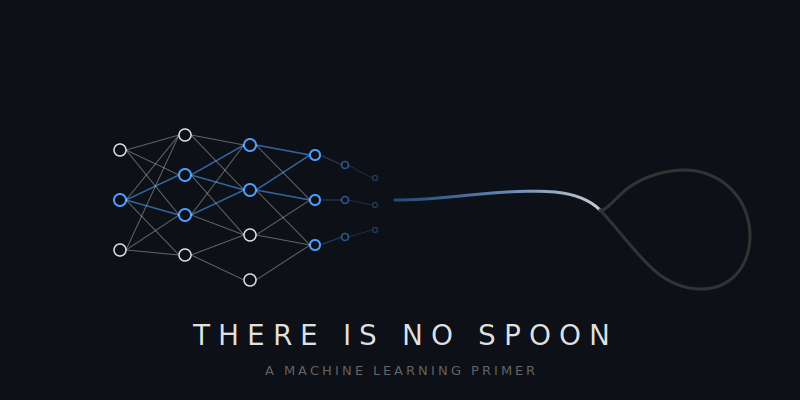

# There Is No Spoon



A machine learning primer built from first principles. Written for engineers who want to reason about ML systems the way they reason about software systems.

## Who This Is For

You're a strong engineer. You can draw a software system on a whiteboard from your own hard-earned mental model. You understand tradeoffs — maintenance vs elegance, performance vs complexity. You have a gut for software design.

You don't have that gut for machine learning yet. You know the tools exist but you can't feel when to reach for which. This primer builds that intuition.

## What Makes This Different

This isn't a textbook or a tutorial. It's a **mental model** — the abstractions you need to reason about ML systems the way you already reason about software systems.

Every concept is anchored in **physical and engineering analogies**: neurons as polarizing filters, depth as paper folding, gradient flow as pipeline valves, the chain rule as a gear train, projections as shadows. These analogies aren't decorative — they're the primary explanation, with math as the supporting detail.

The focus is **when to reach for which tool and why** — not just what each tool does, but the design decision it represents and the tradeoffs it implies.

## What It Covers

The primer is organized in three parts:

**Part 1 — Fundamentals:** The neuron, composition (depth and width as paper folding), learning as optimization (derivatives, chain rule, backprop), generalization, and representation (features as directions, superposition).

**Part 2 — Architectures:** The combination rule family (dense, convolution, recurrence, attention, graph ops, SSMs), the transformer in depth (self-attention, FFN as volumetric lookup, residual connections), encoding, learning rules beyond backprop, training frameworks (supervised, self-supervised, RL, GANs, diffusion), and matching topology to problem.

**Part 3 — Gates as Control Systems:** Gate primitives (scalar, vector, matrix), soft logic composition, branching and routing, recursion within a forward pass, and the geometric math toolbox (projection, masking, rotation, interpolation).

## Read It

The primer is a single markdown file with inline visualizations: **[ml-primer.md](ml-primer.md)**

To jump to a specific topic:
- [The Neuron](ml-primer.md#the-neuron) — start here
- [The Dot Product](ml-primer.md#the-dot-product) — the fundamental primitive
- [Composition: Paper Folding](ml-primer.md#composition-depth-width-and-paper-folding) — what depth buys you
- [Learning as Optimization](ml-primer.md#learning-as-optimization) — derivatives, chain rule, backprop
- [The Combination Rule Family](ml-primer.md#the-combination-rule-family) — convolution vs attention vs recurrence
- [The Transformer](ml-primer.md#the-transformer) — self-attention, FFN, residual connections
- [Frameworks](ml-primer.md#frameworks) — supervised, self-supervised, RL, GANs, diffusion
- [Gates as Control Systems](ml-primer.md#gates-as-control-systems) — the practitioner's gating toolkit
- [Diagnosing Training Problems](ml-primer.md#appendix-diagnosing-and-fixing-training-problems) — loss curve symptoms and fixes

The syllabus shows the full topic map: **[SYLLABUS.md](SYLLABUS.md)**

## Visualizations

All figures are generated from Python scripts in [`scripts/`](scripts/). To regenerate:

```bash
python3 scripts/01_neuron_hyperplane.py
python3 scripts/02_activation_functions.py
# ... etc
```

Requires `matplotlib` and `numpy`.

## Origin

Built through an extended conversational exploration between a software engineer and Claude, where every concept was stress-tested through questions, analogies were iterated until they landed, and misconceptions were corrected in real time. The result is closer to a distilled mentorship than a reference document.

## Contributing

PRs welcome. The goal is high signal — if you can explain a concept more clearly, fix an error, or add a section that fills a gap, open a PR. Keep the tone: direct, concrete, analogies over notation, when-to-use over how-it-works.

## License

MIT
