# Machine Learning: A Practitioner's Mental Model

A high-signal reference built from first principles. Not a textbook — a mental model for engineers who want to reason about ML systems the way they reason about software systems.

> **How to read this.** Each section builds on the ones before it. The Neuron and Composition sections establish the geometric intuition that everything else depends on. Learning as Optimization requires the chain rule, which requires derivatives. The Combination Rule Family and Transformer sections assume you understand the neuron, composition, and optimization. Gates assume all of the above. If something doesn't make sense, check the earlier section it references.

<br>

### 📋 Notation

| Symbol | Meaning | Example |
|--------|---------|---------|
| **w**, **x** | Vectors (bold) | **w** = [0.3, 0.7, -0.2] |
| `w · x` | Dot product — multiply corresponding elements, sum the results | [1, 2] · [3, 4] = 1×3 + 2×4 = 11 |
| `⊙` | Element-wise multiplication — multiply corresponding elements, keep as vector | [1, 2] ⊙ [3, 4] = [3, 8] |
| `W · x` | Matrix-vector multiplication (capital W = matrix) | Transforms a vector through learned weights |
| `\|x\|` | Magnitude (norm) of a vector — its length | \|[3, 4]\| = √(9+16) = 5 |
| `σ` | Sigmoid function: σ(x) = 1/(1+e^(-x)) | Maps any number to (0, 1) |
| `Φ(z)` | Standard normal CDF — probability that a normal random variable is < z | Used in GELU activation |
| `∑` | Summation — add up a series of values | ∑xᵢ = x₁ + x₂ + ... + xₙ |
| `ε` | An infinitesimally small value | Used in derivative derivations |
| `f'(x)` | Derivative of f with respect to x | f(x) = x² → f'(x) = 2x |
| `df/dx` | Same as f'(x), alternative notation | Reads as "the rate of change of f per change in x" |
| `θ` | Angle between two vectors | Used in dot product: w · x = \|w\| \|x\| cos(θ) |
| `e` | Euler's number ≈ 2.718 | The base of the natural exponential; e^x is its own derivative |
| `ln(x)` | Natural logarithm — the inverse of e^x | ln(e^x) = x |
| `→` | "maps to" or "produces" | f(x) = x² → f'(x) = 2x |

---

<br>

## ⚡ The Neuron

A neuron computes one number from a vector of inputs. That's it. Everything else in ML is arrangements of this.

```
z = w · x + b
output = f(z)
```

Three steps: take the dot product of the weights and the input, add a bias, pass through a nonlinearity. To understand the neuron, you need to understand each step.

### The Dot Product

A dot product takes two vectors and produces a single number. Mechanically, you multiply corresponding elements and sum:

```
w = [w₁, w₂, w₃]
x = [x₁, x₂, x₃]

w · x = w₁x₁ + w₂x₂ + w₃x₃
```

Two vectors in, one scalar out. But what does this number *mean*?

Geometrically, the dot product measures **alignment** — how much one vector points in the same direction as another:

```
w · x = |w| |x| cos(θ)
```

where θ is the angle between the two vectors. If they point the same direction (θ = 0°), cos(θ) = 1 and the dot product is maximally positive. If perpendicular (θ = 90°), cos(θ) = 0 and the dot product is zero. If opposite (θ = 180°), cos(θ) = -1 and the dot product is maximally negative.

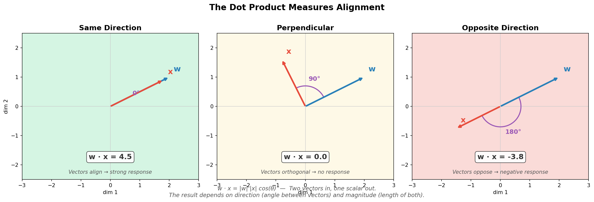

The dot product depends on both alignment (the angle) and magnitude (the lengths of both vectors). Two perfectly aligned vectors produce a small dot product if either is short. Two long vectors produce a small dot product if they're nearly perpendicular. You need both alignment *and* magnitude for a strong response.

### What the Neuron Computes

The neuron's weight vector **w** defines a direction — the direction the neuron "cares about." The dot product `w · x` asks: **how much of the input points in my preferred direction?**

The result is a single number z that encodes two things: its sign tells you which side of the neuron's preferred direction the input falls on, and its magnitude tells you how strongly the input aligns.

**The bias** is a scalar, not a vector. It shifts the threshold. Without it, the neuron's decision boundary (where z = 0) always passes through the origin. With it, the boundary can be positioned anywhere. The bias is a threshold — how aligned does the input need to be before the neuron responds positively?

The set of all inputs where `w · x + b = 0` forms a boundary — a line in 2D, a plane in 3D, a hyperplane in higher dimensions. The neuron divides the entire input space in half along this boundary. On one side z is positive, on the other negative. The magnitude of z tells you how far from the boundary you are.

A neuron is a half-space detector. It gives you a side (which half) and a distance (how deep).

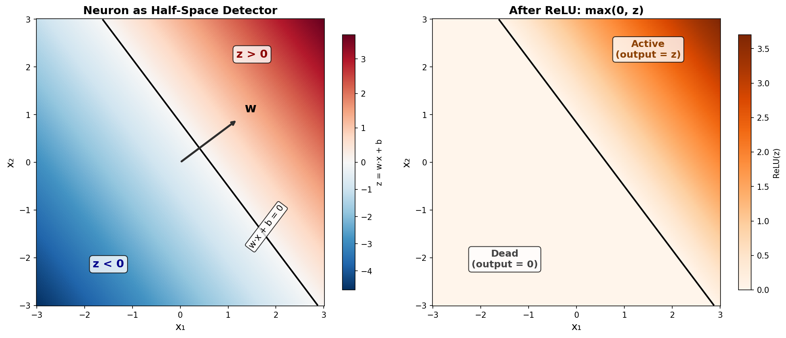

**The nonlinearity** (`f`) transforms z into the neuron's output. Without it, stacking layers collapses into a single linear operation. The nonlinearity breaks linearity and gives the network expressive power.

### Activation Functions as Design Decisions

Each activation function is a different policy for what to do with the side-and-distance information that z provides. Think of gradient flow as a signal propagating through a pipeline. Each nonlinearity is a valve.

<br>

**ReLU: `max(0, z)`** — A gate valve. Fully open or fully closed.
- If z > 0, pass it through unchanged. If z < 0, output zero.
- Gradient is 1 (active) or 0 (dead) — no attenuation when active. This is why ReLU solved vanishing gradients.
- *Failure mode:* neurons can die permanently. If weights update so z is negative for every input, the neuron never recovers.

**Sigmoid: `1 / (1 + e^(-z))`** — A pressure regulator. Squashes everything to (0, 1).
- Smooth, bounded, differentiable everywhere.
- Gradient approaches zero for large |z| — the neuron *saturates*. Confident neurons stop learning.
- *Failure mode:* in deep networks, saturation compounds. Gradients shrink exponentially across layers. This is the vanishing gradient problem.

**tanh** — Same shape as sigmoid but centered on zero, range (-1, 1).
- Same saturation problem, but zero-centering helps gradient flow.
- Better than sigmoid in practice, but both saturate.

**RePU: `max(0, z)^p`** — An amplifier. Polynomial activation.
- A single neuron can represent curves, not just lines.
- *Failure mode:* gradient grows with z, so large activations produce large gradients. Gradient explosion — the opposite problem from sigmoid.

**GELU: `z * Φ(z)`** — A proportional valve. Smooth modulation near zero.
- Multiplies z by the probability that z is "large" under a standard normal distribution.
- No dead zone, no hard cutoff. Near zero, it smoothly modulates rather than hard-switching.
- *Why transformers use it:* attention produces many near-zero signals. The smooth response lets the network learn fine distinctions near the decision boundary.

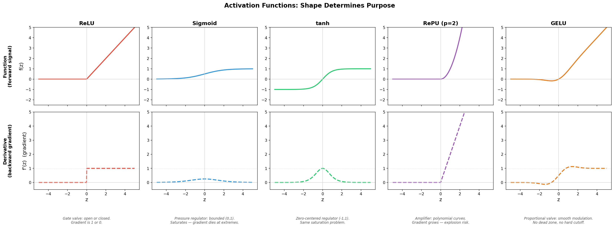

### The Polarizing Filter Analogy

> A neuron is a polarizing filter. Light has a polarization direction (the input). The filter has a preferred axis (the weight vector). Malus's Law says transmitted intensity is `I_in * cos²(θ)` — the component aligned with the filter passes through. Everything else is silently ignored. The weight vector defines what the neuron "cares about." The dot product extracts how much of the input aligns with that axis.

---

<br>

## 📄 Composition: Depth, Width, and Paper Folding

A single neuron makes one decision. What happens when you combine many of them — in a layer, and then stack layers?

### Width: More Cuts Per Layer

A single neuron makes one cut. Two neurons make two cuts, creating up to four regions. n neurons give up to 2^n regions. A layer is a collection of simultaneous cuts partitioning input space.

But every boundary is flat. A single layer can only carve convex regions — like facets of a gem. If the data has curved or non-convex structure, a single layer must approximate it with many small flat cuts, like tracing a circle with a polygon.

### Depth: Folding Space

Take a flat sheet of paper. This is your input space.

First neuron in a layer: draw a line, fold along it. One side stays up, the other folds flat. Points on the dead side lose their identity along that dimension. Points on the active side keep their position.

More neurons: more folds, more creases. The paper is now a creased, partially flattened object.

The next layer draws straight lines on this folded paper and cuts. Unfold the paper. The straight cuts are no longer straight — they're bent at every crease. The folds turned straight cuts into complex boundaries.

**Each layer folds. Each subsequent layer cuts. The folds make simple cuts produce complex boundaries in the original space. The folds are the activation function.** Without the activation function there's no fold — the space passes through unchanged and depth adds nothing.

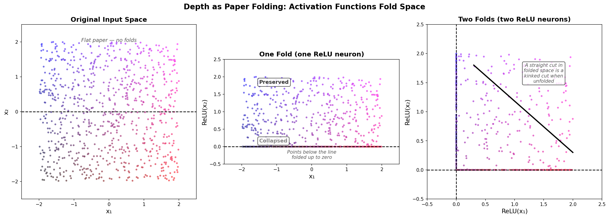

### Width vs Depth Tradeoff

A single wide layer can approximate any function (universal approximation theorem). But "enough width" can mean absurdly many neurons. A function with n nested oscillations takes O(n) neurons deep but O(2^n) neurons wide. Depth gives exponential efficiency for hierarchically structured functions.

**Too wide, too shallow**: massive capacity, no structural bias. Solutions tend to be brittle — lots of finely tuned cuts rather than a clean hierarchy. Training is harder because the loss landscape is broad and flat.

**Too deep, too narrow**: forced into a sequential pipeline. Information must survive every layer — if it's not useful at layer 3 but needed at layer 10, it can be destroyed (bottleneck problem). Longer chain rule products mean worse gradient pathology. Needs tricks like skip connections or normalization.

**Sweet spot**: moderate depth with moderate width. Hierarchical problems (images, language) reward depth. Flat discrimination problems (tabular data) often do better with width.

> **Key insight:** Width gives you resolution (finer partitions). Depth gives you complexity (curved, nested boundaries). They do different things, and the cost of getting the balance wrong is different in each direction.

---

<br>

## 📉 Learning as Optimization

The network starts with random weights. Its output is wrong. Learning is the process of adjusting every weight so the output gets less wrong. To understand how, you need derivatives and the chain rule. If you're already comfortable with calculus, skip to [The Chain Rule](#the-chain-rule).

### What a Derivative Is

A derivative answers a simple question: **if I nudge the input a little, how much does the output change?**

For a function `f(x) = x²`, you can see this with concrete numbers:

```
f(3)    = 9
f(3.01) = 9.0601     change of 0.0601 for a nudge of 0.01 → rate ≈ 6.01
f(3.001)= 9.006001   change of 0.006001 for a nudge of 0.001 → rate ≈ 6.001
```

As the nudge gets smaller, the rate converges to exactly 6. That's the derivative of x² at x = 3: the slope of the curve at that exact point.

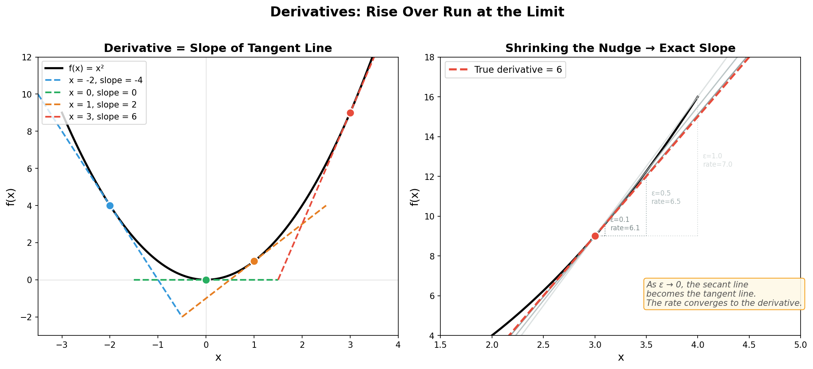

The left panel shows tangent lines at different points on the curve x². The slope (derivative) changes as you move along the curve: negative on the left, zero at the bottom, increasingly positive on the right. The right panel shows the "nudge" method converging: as ε shrinks, the secant line (rise/run between two points) approaches the tangent line (the true derivative).

A derivative is just **rise over run**, but for an infinitely small run. It's a local exchange rate — how much output you get per unit of input, at this specific point.

### Deriving a Derivative from Scratch

Let's derive the derivative of `f(x) = x²` from first principles. Start at some point x, nudge it by a tiny amount ε, and measure how f changes.

First, expand `(x + ε)²`. This uses **FOIL** — a method for multiplying two binomials (expressions with two terms). FOIL stands for First, Outer, Inner, Last:

```
(x + ε)(x + ε)

First:  x · x = x²
Outer:  x · ε = xε
Inner:  ε · x = xε
Last:   ε · ε = ε²

Sum: x² + xε + xε + ε² = x² + 2xε + ε²
```

FOIL is just the distributive property applied systematically — every term in the first parentheses multiplied by every term in the second, so you don't miss any combinations.

Now compute the rise (how much f changed):

```
f(x + ε) - f(x) = (x² + 2xε + ε²) - x²
                 = 2xε + ε²
```

We subtracted f(x) = x² because we want to isolate how much the nudge moved the output, not the output itself.

Divide by the run (ε) to get the rate:

```
rate = (2xε + ε²) / ε = 2x + ε
```

Now let ε shrink to zero. The ε term vanishes, and what survives is **2x**.

That's the derivative of x². At x = 3, the derivative is 2(3) = 6 — matching our numerical experiment above.

### The Power Rule and Common Derivatives

The same process works for any power of x. The pattern:

```
f(x) = x¹   →  f'(x) = 1        (constant slope)
f(x) = x²   →  f'(x) = 2x       (we just derived this)
f(x) = x³   →  f'(x) = 3x²
f(x) = x⁴   →  f'(x) = 4x³
```

The rule: bring the exponent down as a multiplier, reduce the exponent by one. For x^n, the derivative is nx^(n-1). This is the **power rule**.

Other common derivatives you'll encounter in ML:

```
f(x) = e^x   →  f'(x) = e^x      the function whose rate of change equals itself
                                    (this is why e appears everywhere in ML)
f(x) = ln(x) →  f'(x) = 1/x
f(x) = sin(x)→  f'(x) = cos(x)
f(x) = c     →  f'(x) = 0         a constant doesn't change, so the rate is zero
```

Each of these can be derived the same way — write out f(x + ε) - f(x), divide by ε, shrink ε to zero. They just involve more algebra.

### The Chain Rule

In a neural network, the output depends on the last layer, which depends on the previous layer, which depends on the one before that. To learn, we need to know how changing a weight in layer 1 affects the final output. That's a chain of dependencies.

The chain rule says: **the total rate of change through a chain of functions is the product of the local rates.** Multiply each link's rate together.

```
f(g(x)):  df/dx = df/dg × dg/dx
```

Think of it as a **gear train**. The first gear converts x-motion into g-motion at some ratio. The second gear converts g-motion into f-motion at some ratio. The overall ratio is the product of the individual ratios.

Or think of it as **unit conversion**: miles/gallon × gallons/hour = miles/hour. The intermediate unit (gallons) cancels out.

For a single neuron with ReLU and squared-error loss:

```
z = wx + b          (linear step)
a = ReLU(z)         (activation)
L = (a - y)²        (loss)
```

We want dL/dw — how changing the weight affects the loss:

```
dL/dw = dL/da × da/dz × dz/dw
```

Each factor is a local derivative using whatever rule fits:
- `dL/da = 2(a - y)` — power rule on the loss. How wrong is the output?
- `da/dz = 1 or 0` — ReLU's derivative. Is the neuron active?
- `dz/dw = x` — z = wx + b is linear in w, so the rate is just x.

Multiply them: **`dL/dw = 2(a - y) × (1 or 0) × x`**

The weight update is proportional to how wrong the output was, gated by whether the neuron was active, scaled by the input. Each term makes sense on its own. The chain rule just says: multiply them.

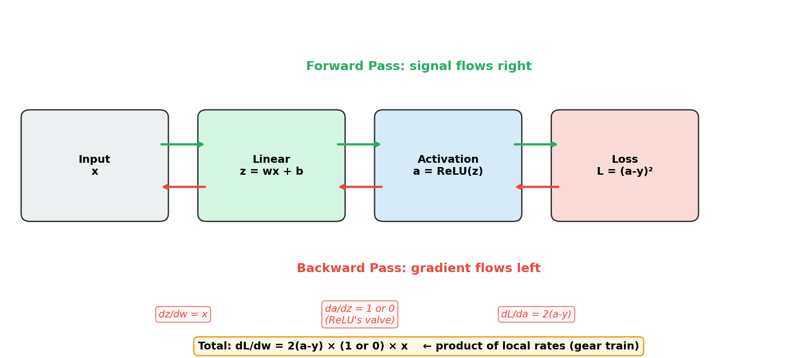

In a deep network, the chain just gets longer — one factor per layer. Each factor is still a simple local derivative. This is what makes deep learning work: you never have to understand the whole network at once. Each layer contributes its local rate, and the product gives you the global gradient.

**Backpropagation** is the chain rule applied layer by layer from output to input. Each layer receives an error signal from above, computes its weight updates, and passes a transformed error signal backward. The activation function's derivative gates the backward signal at each layer — this is why the choice of nonlinearity matters for learning, not just representation.

### The Loss Landscape

Every possible configuration of weights maps to a loss value. This surface has as many dimensions as there are weights. Training is finding a low point.

**Gradient descent**: compute the slope in every direction, step opposite to steepest ascent. Repeated small steps downhill.

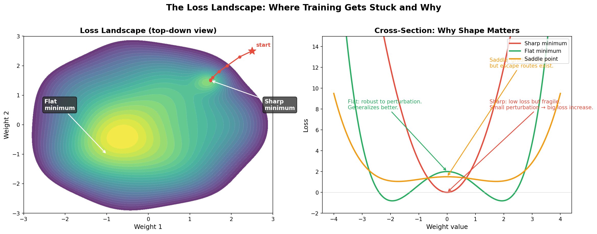

### Why Things Get Stuck

**Vanishing gradients**: chain rule product of factors less than 1 shrinks exponentially through layers. Sigmoid's max derivative is 0.25 — five layers gives at most 0.25⁵ ≈ 0.001 of the original signal. ReLU's derivative is 1 when active, so gradients pass through at full strength.

**Exploding gradients**: chain rule product of factors greater than 1 grows exponentially. Large weights or polynomial activations can cause this. Weight updates become enormous and the network diverges.

**Saddle points**: zero gradient, but not a minimum. Like sitting on a horse saddle — minimum front-to-back, maximum side-to-side. In high dimensions, saddle points vastly outnumber true minima. For a point to be a true minimum, every direction must curve up. In a million dimensions, a random critical point will have roughly half its directions curving up and half down.

**Sharp vs flat minima**: both have low loss, but sharp minima are fragile — small perturbations in data send loss shooting up. Flat minima are robust and generalize better. A high learning rate bounces out of sharp minima but can settle into broad ones — implicit selection for generalization.

---

<br>

## 🎯 Generalization

### Why It Works (And Shouldn't)

Classical theory says: more parameters than data points means overfitting. Neural networks violate this — massively overparameterized yet they generalize. Not fully understood, but several contributing factors:

**The optimizer is biased.** Gradient descent from random initialization finds simpler functions first — smooth, low-frequency patterns before noise. Early stopping captures pattern without noise. The optimizer has an implicit bias toward simplicity.

**The parameterization constrains.** A million parameters don't act independently. They interact through layers — changing one weight affects the function globally. The network can't easily be an arbitrary lookup table. The parameter count overstates the effective complexity.

**Flat minima.** SGD with mini-batch noise settles in broad regions of the loss landscape. These correspond to solutions robust to perturbation — robust to train/test differences.

### Regularization as Design Philosophy

Not a checklist of techniques. A single principle: **constrain the search space so the solutions the optimizer finds are ones that generalize.** Each method does this differently, addressing different failure modes:

**L2 regularization (weight decay)** — penalizes large weights, pushing toward smaller, smoother functions. Among all solutions that fit the data, prefer the simpler one.

**Dropout** — randomly zeroes neurons during training. Forces redundancy — no single neuron can memorize a specific feature. An ensemble method hiding inside a single network.

**Data augmentation** — expands training set with transformations. Not a regularizer on the model — a regularizer on the data. Fills gaps in the sparse sample of the true distribution.

**Early stopping** — stop when validation loss starts rising. The network learned the pattern and is now fitting noise.

> **Key insight:** Regularization isn't a bag of tricks. It's one principle — constrain the space of solutions to prefer the ones that generalize — applied through different mechanisms depending on the failure mode.

---

<br>

## 🧠 Representation: What Networks Actually Store

We've covered what networks compute. Now: what do they *know*, and where is that knowledge?

### Features as Directions

A randomly initialized network has no meaningful directions. Training carves out directions in activation space that reduce loss. A feature is a direction the network consistently uses to represent a property of the input. Features aren't designed — they're the residue of optimization.

The individual node is not the unit of meaning. The vector produced by the entire layer is. A node is one coordinate. A feature is a direction in the full vector space, spread across all nodes. Two features are similar if their directions are nearly parallel. They're unrelated if nearly perpendicular.

### Superposition

The number of nearly-perpendicular directions in high-dimensional space vastly exceeds the number of dimensions. A 4096-dimensional layer can encode far more than 4096 features by superimposing them — packing more features than dimensions, arranged to minimize mutual interference.

Features that share substrate tend to be features that rarely co-occur in the data (low collision risk). Related features cluster in nearby directions (geometric neighborhoods). The structure is learned, not random.

**Superposition is load-bearing for generalization.** Shared substrate forces the network to capture structure — relationships between features are baked into the geometry. Novel inputs activate blended patterns and get reasonable responses. The cost: interference between features when they do co-occur, which is one contributor to hallucinations (among multiple causes).

Vector arithmetic works approximately in neural representations (king - man + woman ≈ queen) because directions encode semantic relationships. The algebra is a side effect of optimization, not a guarantee. Some directions compose cleanly, others don't.

### Distributed Representation and Its Consequences

Knowledge is distributed across the geometry of entire layers, not localized in individual neurons. This means:

**You can't surgically modify knowledge.** Editing one direction risks perturbing others that share the same neurons.

**Continual learning is hard.** New features need directions. Creating them perturbs existing directions. Old knowledge degrades. This is catastrophic forgetting — a consequence of distributed representation, not a failure of the optimizer. Approaches exist (EWC: protect important weights; progressive networks: freeze old, add new; memory replay: mix old and new data) but none solve the fundamental problem.

**Knowledge decoupling is hard.** Knowledge (which features exist) and computation (how features combine) are the same weights. A weight matrix simultaneously defines which directions exist and how the next layer transforms them.

### Transfer Learning

A trained network's weights provide better initialization than random — features are partially formed, and the optimizer has less distance to travel. This works when source and target tasks share structure. It fails when they don't.

Transplanting trained layers into an untrained network: freeze them and they work as fixed feature extractors. Don't freeze them and random downstream layers send incoherent gradients that destroy the trained features. A layer's weights are adapted to the layers around it — remove that context and the contract is broken.

### Training Is Not Deterministic

GPU floating point operations don't guarantee execution order — identical inputs can produce different rounding errors that compound. Two runs from different initializations converge to functionally similar but geometrically different solutions. The loss landscape has many equally good minima — which one the optimizer finds depends on the path taken.

---

<br>

## 🔀 The Combination Rule Family

Every architecture does three things: combine inputs according to some rule, apply a nonlinearity, repeat. The only difference between architectures is step 1 — the combination rule. That's where the inductive bias lives.


**Dense** — every input connects to every output. No assumption. Maximum flexibility, maximum parameters. The standard multi-layer perceptron (MLP) is stacked dense layers.

<br>

**Convolution** — small sliding dot product with shared weights.
- Assumes locality and translation invariance. Far fewer parameters.
- Hierarchical feature composition: edges → textures → objects across layers.
- Pooling, stride, and dilation control how the receptive field expands.
- *Breaks down when:* locality is wrong, translation invariance is wrong, or data isn't on a grid.
- *Landmark models:* LeNet (1998, handwritten digits), AlexNet (2012, ImageNet breakthrough), ResNet (2015, residual connections enabled 100+ layers), U-Net (2015, image segmentation, backbone of diffusion models).

<br>

**Recurrence** — sequential state-carrying. `h_t = f(W_h · h_(t-1) + W_x · x_t + b)`.
- A fixed-size vector summarizes all history. Each step is a lossy relay.
- Eigenvalues of W_h determine information decay rates per direction: < 1 decays, > 1 explodes, = 1 preserved.
- Vanilla RNNs fail beyond ~10-20 steps.
- LSTMs add an additive cell state (conveyor belt) with learned gates (forget, input, output) — same trick as residual connections. GRUs simplify to one update gate.
- *Replaced by attention for:* parallelism, no compression bottleneck, shorter gradient paths.
- *Still wins for:* streaming, constant memory, strict causality.
- *Landmark models:* LSTM (1997, Hochreiter & Schmidhuber), GRU (2014, Cho et al.), seq2seq (2014, encoder-decoder for translation — where attention was invented as a patch for the compression bottleneck).

<br>

**Attention** — dynamic, content-dependent combination.
- Three projections per element: **query** (what am I looking for?), **key** (what do I contain?), **value** (what do I provide?).
- Dot product of query against all keys determines relevance. Softmax normalizes to a distribution. Output is weighted sum of values.
- Q/K/V are the complete decomposition of a routing operation — no additional projections have proven necessary.
- *Landmark models:* Transformer (2017, "Attention Is All You Need"), BERT (2018, bidirectional encoder), GPT series (2018-present, autoregressive decoder), Vision Transformer/ViT (2020, patches + attention for images).

<br>

**Graph operations** — message passing over explicit topology.
- Nodes collect from neighbors, aggregate, update. Convolution generalized to irregular structure.
- *Excels when:* relationships are known (molecules, physics).
- *Limitation:* oversmoothing — too many rounds and all nodes converge.
- *Landmark models:* GCN (2017, Kipf & Welling), GAT (2018, attention-weighted edges), SchNet (2017, molecular property prediction), AlphaFold 2 (2020, protein structure with graph + attention).

<br>

**State-space models** — continuous-time recurrence from control theory. `dx/dt = Ax + Bu, y = Cx + Du`.
- Can be computed as recurrence (O(1) memory) or convolution (parallel training).
- HiPPO provides mathematically optimal history compression. Mamba added input-dependent gating.
- Bridges recurrence and convolution.
- *Landmark models:* S4 (2021, first efficient SSM), Mamba (2023, selective state spaces), Jamba (2024, SSM-attention hybrid).

<br>

**Sparse/structured matrices** — constrained connectivity for efficiency. Block-diagonal (independent groups), low-rank (bottleneck factorization), butterfly (hierarchical pairwise mixing in O(N log N)). Sometimes matches data structure, sometimes purely a compute approximation.

> **Key insight:** When you choose an architecture, you're choosing a combination rule — which inputs should influence which outputs, and how much. That's the single design decision that matters most. Everything else (nonlinearity, gradient flow, loss, training) is shared machinery.

---

<br>

## 🤖 The Transformer

The dominant architecture. Understanding its internals is essential for reasoning about modern ML systems.

A transformer block: self-attention (route information between elements), feed-forward network (apply stored knowledge per element), both wrapped in residual connections and layer normalization. Repeated N times.

### Self-Attention

Each element in the sequence generates Q, K, V vectors via learned projection matrices. Each element's query is dot-producted against all keys to determine relevance. Softmax produces attention weights. Output is weighted sum of values. Connectivity is dynamic — determined by content, computed fresh for every input.

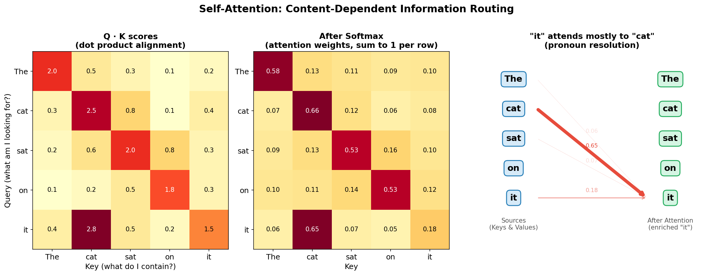

### Multi-Head Attention

Multiple independent attention operations in parallel, each on a slice of the vector. Each head learns a different relevance pattern (syntactic, semantic, positional). Outputs are concatenated losslessly, then a projection remixes them into a unified representation. This isn't finer resolution of the same measurement — it's multiple *different* measurements. Each head asks a different question about which elements are relevant.

### Positional Encoding

Attention is permutation-invariant — it has no concept of order. Position must be injected. Sinusoidal (fixed mathematical patterns), learned embeddings (vector per position), RoPE (rotation applied to Q/K so dot products reflect relative distance — existing linear algebra property recognized as exact solution), ALiBi (distance-based penalty on attention scores).

### Feed-Forward Layers

Per-element, position-independent. Expansion to higher dimension (512 → 2048), GELU activation, contraction back (2048 → 512). This is a volumetric lookup — the vector activates a neighborhood in a learned feature space. The activation region is irregular and content-dependent — spines of varying length in non-uniform directions, with fuzzy boundaries from GELU. Features within that region are blended and compressed back.

Attention routes information between elements. The FFN applies stored knowledge per element. Division of labor is clean.

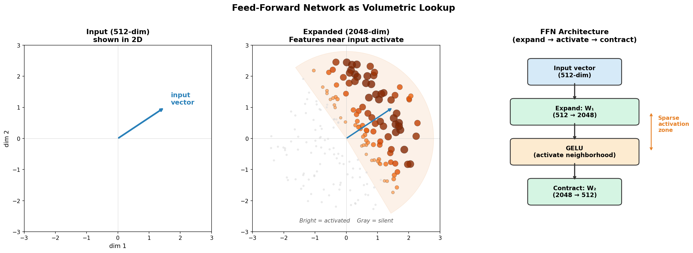

FFN layers are where factual knowledge lives. Specific rows of W₁ activate for specific facts. This is the basis for model editing techniques (ROME, MEMIT) — treating the FFN as a key-value memory and writing directly to it.

### Residual Connections

`output = x + Sublayer(x)`. Each layer adds a delta rather than replacing. The vector is a running sum: `x + delta_1 + delta_2 + ... + delta_N`. Preservation is the default — a layer must actively write to contribute, but does nothing to preserve. Gradient flows directly through addition (derivative = 1) regardless of depth. Individual deltas recoverable by subtracting consecutive intermediate vectors.

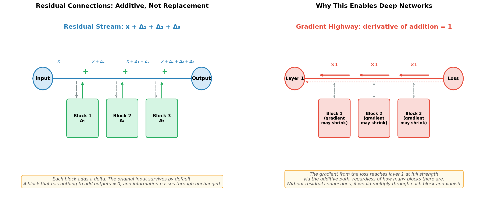

### Encoder-Decoder vs Decoder-Only

Encoder-decoder: encoder processes full input with bidirectional attention, decoder generates output token by token with causal masking, cross-attention connects them. Stronger inductive bias for tasks with distinct input/output (translation).

Decoder-only: single decoder with causal masking. Input and output are the same sequence. Simpler, more general. At sufficient scale, the generality wins.

---

<br>

## 🔤 Encoding

The encoder converts raw data into the vector format the downstream architecture operates on. It determines the ceiling — the model can only learn from what the encoder preserves.

Three decisions: what is an element (granularity), what does each element's vector capture (raw vs contextualized), and what structural information is preserved (order, adjacency, hierarchy).

**The encoder must preserve what you need, and you decide that before choosing the encoder, not after.** A pretrained encoder optimized for one objective may actively destroy information another task requires. End-to-end training solves the encoder-model alignment problem — the gradient tells the encoder what the downstream model needs. Without end-to-end training, you're hand-engineering the interface.

**Per-modality encoders:**
- *Text:* tokenize into subwords (BPE, WordPiece, SentencePiece) + learned embedding per token. Tokenizer choice determines what the model can see — "unhappy" as one token vs "un" + "happy" as two changes whether compositional structure is visible.
- *Images:* raw pixels on a grid (for CNNs), or split into patches and project each patch (for ViTs). Patch size is the granularity tradeoff — 16×16 is standard.
- *Audio:* convert to spectrogram (time-frequency image), then convolutional front-end or patch embedding. Whisper (2022) and Wav2Vec (2020) are landmark audio encoders.
- *Graphs:* define what is a node, what is an edge, what features attach to each. This requires domain knowledge — the graph structure *is* the encoding.

**Multimodal alignment**: adapter per modality projecting into shared dimensionality. The projection is easy — the alignment is hard. Contrastive training (CLIP) provides the signal that makes semantically matched inputs from different modalities land in the same region of the shared space. GPT-4o and Gemini process multiple modalities through aligned encoders into a shared transformer.

---

<br>

## 📐 Learning Rules

Backprop dominates, but it's not the only way networks learn. Understanding the alternatives clarifies what backprop actually provides — and what it costs.

**Backpropagation** — exact global gradient via chain rule. Dominant because nothing else matches its efficiency at scale.

Downsides:
- Requires differentiability — can't backprop through discrete decisions
- Requires storing all activations — memory scales with depth
- Backward pass is as expensive as forward
- Sequential layer-by-layer backward — synchronization bottleneck
- Catastrophic forgetting — gradient only sees current batch
- No learning at inference time
- Gradient pathology scales with depth

**Hebbian learning** — "neurons that fire together wire together." `Δw = η · x_i · x_j`. Local, no global error signal. Learns correlations, not task mappings. Natural associative memory, supports continual learning. Capacity ~0.14N patterns for N neurons. Classical Hopfield networks (1982) are the canonical example.

**Modern Hopfield networks** (Ramsauer et al., 2020) — exponential energy function dramatically increases storage capacity. The update rule is mathematically equivalent to transformer attention. Attention *is* Hopfield retrieval.

**Contrastive learning** — training objective, not a weight update rule. Make similar things close, dissimilar things far. Learns representations without labels. Uses backprop for weight updates, but the training signal comes from data structure, not human labels. SimCLR (2020), CLIP (2021), and DINO (2021) are landmark examples.

**Energy-based models** — define energy over configurations, learn the landscape, inference is energy minimization. Enables iterative refinement at inference — the model can "think longer" about hard inputs. Multiple low-energy states signal ambiguity. Cost: slower than single forward pass. Boltzmann machines (1985) and deep equilibrium models (2019) are notable examples.

**Learned loss functions** — when the objective is too complex to specify mathematically (what makes a good image? a helpful response?), train a network to learn the objective from examples. GANs do this (discriminator is a learned loss). RLHF does this (reward model is a learned loss). General principle: when you can judge quality but can't formalize it, learn the loss function.

---

<br>

## 🏋️ Frameworks

The training objective — what the model optimizes for. Independent of architecture and learning rule.

**Supervised** — inputs and correct outputs. Model predicts, compares to answer, updates.
- Limited by labeled data.
- *Examples:* ImageNet classification (ResNet, EfficientNet), machine translation (early seq2seq), speech recognition (DeepSpeech), medical image diagnosis.

<br>

**Self-supervised** — hide part of input, predict the hidden part. Labels come from data itself.
- Power is scale — unlabeled data is effectively unlimited. This is how most foundation models are trained.
- *Masked prediction:* BERT (2018) masks words, predicts from context. MAE (2022) masks image patches.
- *Autoregressive prediction:* GPT series (2018-present) predicts the next token. Grammar, semantics, world knowledge, reasoning — all emerge from this objective at scale.
- *Contrastive:* SimCLR (2020) and CLIP (2021) push similar pairs close, dissimilar pairs apart in embedding space.

<br>

**Reinforcement learning** — no correct answers, only rewards.
- Model takes actions, receives sparse/delayed reward, learns a policy.
- Much harder than supervised — weak learning signal, credit assignment problem.
- *Examples:* AlphaGo/AlphaZero (2016-2017), OpenAI Five (2019), RLHF for LLM alignment (InstructGPT 2022, used in ChatGPT, Claude, etc.), robotics control (RT-2).

<br>

**GANs** — generator produces fake data, discriminator distinguishes real from fake.
- Adversarial dynamic produces sharp, high-quality samples. Training is notoriously unstable (mode collapse, balancing).
- Dominated image generation 2016-2021, then replaced by diffusion.
- Core insight: the discriminator is a *learned loss function* — when you can't write a formula for "good output," train a network to judge it.
- *Examples:* DCGAN (2015), StyleGAN (2019, photorealistic faces), Pix2Pix (2017, image-to-image), CycleGAN (2017, unpaired style transfer).

<br>

**Diffusion** — define a noise-adding process that destroys data over T steps. Train a network to reverse each step.
- Generation: start from noise, iteratively denoise. Training is stable (simple regression — predict the noise).
- Quality matches or exceeds GANs. Cost: hundreds of denoising steps per sample.
- Key insight: iterative refinement allocates compute proportionally to difficulty.
- *Examples:* DALL-E 2 (2022), Stable Diffusion (2022, open-source), Midjourney, Sora (2024, video), Mercury (2025, diffusion for text tokens).

---

<br>

## 🗺️ Topology for the Problem

You know the building blocks. Now: given a problem, how do you choose?

Architecture choice is driven by data structure, task requirements, data quantity, and compute constraints. This section is the decision guide — the part that connects everything above to the question "what do I actually build?"

### The Decision Table

| Question | Signal | Architecture |
|----------|--------|-------------|
| Data on a grid? | Spatial locality, translation invariance | Convolutions |
| Sequential data? | Order matters, history needed | Attention, recurrence, or SSMs |
| Known relational structure? | Explicit edges between entities | Graph networks |
| Tabular data? | Flat features, no spatial/temporal structure | Dense layers or gradient-boosted trees |
| Unknown/complex structure? | No clear structural prior | Transformer |
| Very long sequences? | Memory and compute constraints | SSMs or sparse attention |
| Streaming / real-time? | Can't buffer full input | Recurrence or SSMs |
| Very little data? | Need strong inductive bias | Architecture with matching assumptions |
| Abundant data? | Can learn structure from scale | Transformer |

### Worked Examples

These walk through the reasoning from problem to architecture — the thought process, not just the answer.

<br>

**Example 1: Medical image classification**

| Aspect | Reasoning |
|--------|-----------|
| Data structure | Grid (X-ray images) |
| Key property | Spatial locality — a lesion is a local pattern |
| Translation invariance? | Yes — a fracture looks the same anywhere in the image |
| → Architecture | **Convolutions** |
| Data quantity | Small (thousands, not millions) → strong inductive bias needed |
| → Approach | Pretrained ResNet or EfficientNet, fine-tuned |
| Framework | Supervised (images + diagnostic labels) |
| Encoder | Pixel grid — natural, no design needed |
| If adding text notes? | Attention-based text encoder + multimodal fusion. Image backbone stays convolutional. |

<br>

**Example 2: Real-time sensor anomaly detection**

| Aspect | Reasoning |
|--------|-----------|
| Data structure | Streaming time series from industrial sensors |
| Key property | Strictly causal — can't look at future readings |
| Sequence length | Infinite — stream never ends, can't buffer |
| → Architecture | **Recurrence or SSMs** (constant memory, causal by construction) |
| Why not attention? | Quadratic cost, needs the full sequence buffered |
| Why SSMs specifically? | Data is continuous and time-varying — SSMs model continuous-time dynamics |
| If multiple sensors? | Add graph structure over sensor network. Message passing between nodes at each step. |

<br>

**Example 3: Code generation from natural language**

| Aspect | Reasoning |
|--------|-----------|
| Data structure | Sequential text → sequential code |
| Key property | Long-range dependencies (variable at top of function matters at bottom) |
| Relevance pattern | Content-dependent — which spec parts matter depends on current generation |
| → Architecture | **Attention (transformer)** |
| Input/output modality | Same (text tokens) → decoder-only |
| Training strategy | Pretrain on code corpora (self-supervised, next-token) → fine-tune on instruction-code pairs → RLHF for alignment |
| Encoder | Subword tokenizer that handles code well (preserves indentation, doesn't split keywords) |

<br>

**Example 4: Molecular property prediction**

| Aspect | Reasoning |
|--------|-----------|
| Data structure | Graphs — atoms are nodes, bonds are edges |
| Key property | Topology is known and physically meaningful |
| → Architecture | **Graph networks** |
| How it works | Message passing along bonds. 1 hop = immediate neighbors. Multiple hops = extended structure. |
| If global properties matter? | Add attention layers so distant atoms can interact directly |
| Hardest part | The **encoder** — choosing atom features (element, charge, hybridization) and bond features (type, length, aromaticity) requires domain knowledge. This determines the ceiling. |

<br>

**Example 5: Multi-turn dialogue system**

| Aspect | Reasoning |
|--------|-----------|
| Data structure | Text in, text out |
| Core model | Decoder-only transformer (pretrained, probably frozen) |
| **The real decisions** | Not the core architecture — everything *around* it |
| Context management | How to encode and manage conversation history |
| Knowledge | When to retrieve (RAG) vs rely on training (parametric) |
| Tool use | Output gating and routing |
| Memory | State management across turns |
| Where to look | The sections on **gates**, **encoding**, and **frozen-model interfaces** are more relevant than raw architecture |

### Hybrid Architectures

Real problems rarely fit one architecture perfectly. The practical approach: **use the cheapest operation that captures the structure at each level of processing.**

- *Local patterns?* Convolutions. Cheap, strong assumption, few parameters.
- *Global routing?* Attention. Expensive, flexible, content-dependent.
- *Long-range persistence?* Recurrence or SSMs. Constant memory, causal.
- *Known relationships?* Graph operations. Structure-aware, topology-dependent.

Stack them where each one's strength is needed. Vision transformers use convolutional patch embedding (local) + attention across patches (global). Conformer uses convolutions and attention interleaved for speech. Jamba uses SSM layers for efficient long-range and attention layers for complex routing.

The design principle: match the operation to the structure at each stage. Don't pay for global attention on local patterns. Don't force local convolutions on global dependencies.

### The Scale Caveat

**Practical reality:** most practitioners start with a transformer. If it works, they stop. At sufficient scale, architecture matters less — the transformer learns what other architectures would have given for free.

The counterpoint: "sufficient scale" means billions of parameters and massive training budgets. If your budget is smaller, architecture choice matters enormously. A CNN with 10M parameters can match a transformer with 100M parameters on image tasks — if your budget is 10M parameters, the architecture decision is a 10x multiplier on effective capacity.

---

<br>

## 🧩 Design Patterns

Common problem shapes and the class of solutions that address them. This is the "I've seen this before" section — the patterns that recur across different domains and tasks.

### When the Model Memorizes Instead of Learns

**Signal:** Training loss keeps dropping. Validation loss stops improving or gets worse.

**Diagnosis:** The model is fitting the specific training examples — including their noise — rather than the underlying pattern. This is an overfitting problem, not a capacity problem.

**Solutions, in order of what to try first:**
1. More data or data augmentation. The most reliable fix. The model is memorizing because it can — with more data, memorizing becomes harder than learning the pattern.
2. Dropout. Forces distributed representation — no single neuron can memorize a specific example.
3. Weight decay (L2 regularization). Penalizes large weights, pushing toward smoother functions.
4. Early stopping. Stop training before the model starts fitting noise.
5. Reduce model size. Only if the above don't work — smaller models have less capacity to memorize, but also less capacity to learn.

**Not the solution:** More training. More layers. Fancier optimizer. These add capacity or training intensity to a model that already has too much of both.

<br>

### When the Model Underfits

**Signal:** Both training and validation loss are high. The model isn't learning the pattern at all.

**Diagnosis:** The model doesn't have enough capacity, the learning rate is wrong, or the architecture's inductive bias doesn't match the data.

**Solutions:**
1. Make the model bigger (more layers, more width). If loss drops, the model was too small.
2. Train longer. The model might not have converged yet.
3. Check the learning rate. Too low = stalls. Too high = oscillates. Try a schedule.
4. Check the architecture. A CNN on sequential data, or dense layers on an image — the wrong inductive bias wastes capacity fighting the data structure.
5. Check the data. Noisy labels, preprocessing bugs, or insufficient features create hard ceilings that no model can overcome.

<br>

### When Local Patterns Work but Global Context Is Missing

**Signal:** The model handles simple, localized examples well but fails on examples that require integrating distant information. A CNN that classifies isolated objects but fails when the scene context matters. A local model that handles individual sentences but misses cross-paragraph references.

**Reach for:**
- Add attention layers on top of the local model — convolutions handle local features cheaply, attention handles global routing.
- Or increase depth so the receptive field spans the full input.
- Or switch to a transformer if the problem is fundamentally global.

<br>

### When Short Sequences Work but Long Ones Degrade

**Signal:** Performance is good up to some sequence length and degrades beyond it. The degradation may be gradual (recurrence, SSMs) or sudden (attention hitting memory limits).

**Diagnosis:** Compression bottleneck (recurrence), quadratic cost (attention), or positional encoding limits (some transformers can't generalize beyond trained lengths).

**Reach for:**
- SSMs for efficient long-range (linear cost, principled compression).
- Sparse attention for retaining direct access while reducing cost.
- Sliding window attention for local context with occasional global tokens.
- If using recurrence, check the hidden state size — increasing it extends the compression horizon.

<br>

### When the Model Needs to Handle a New Modality

**Signal:** You have a working system for one data type and need to add another — text + images, code + documentation, sensor data + metadata.

**This is an encoder problem, not an architecture problem.** The core model usually stays the same. The decision is: how to encode the new modality, and how to align it with the existing representation.

**Approach:**
- Per-modality encoder projecting into the shared dimensionality.
- The encoder must preserve what the downstream model needs.
- The alignment is the hard part — contrastive training on paired data (CLIP-style) or joint training where the gradient tells both encoders what to preserve.

<br>

### When You Can't Define the Loss Function

**Signal:** You know what a good output looks like but can't write a formula for it. "Generate a realistic image." "Write a helpful response." "Produce natural-sounding speech."

**Reach for:** A learned loss function. Train a discriminator (GAN) or a reward model (RLHF) on examples of good and bad outputs. The learned model becomes the loss function. This converts human judgment into gradient signal.

**The tradeoff:** The learned loss is only as good as its training examples. Gaps in coverage become exploitable weaknesses — the generator finds outputs the discriminator can't evaluate.

<br>

### When Training Is Unstable

**Signal:** Loss spikes, NaN values, mode collapse, oscillating metrics.

**Check in order:**
1. Learning rate — too high is the most common cause of instability.
2. Gradient norms — if they're spiking, add gradient clipping.
3. Weight initialization — too-large initial weights amplify instability through the chain rule.
4. Architecture — very deep networks without residual connections or normalization are inherently unstable. Add them.
5. Batch size — too small gives noisy gradient estimates. Too large can converge to sharp minima. 32-256 is usually a safe range.
6. If using GANs — adversarial training is inherently unstable. Consider switching to diffusion if the instability is persistent.

<br>

### When You Need the Model to Say "I Don't Know"

**Signal:** The model must distinguish between confident predictions and uncertain ones. High-stakes decisions, active learning, safety-critical systems.

**Standard approach:** Calibrated confidence scores. Softmax outputs are often overconfident — calibration techniques (temperature scaling, Platt scaling) adjust them to reflect true uncertainty.

**Stronger approaches:**
- **Ensembles** — train multiple models. Disagreement = uncertainty.
- **Monte Carlo dropout** — run inference multiple times with dropout active. Variance = uncertainty.
- **Energy-based models** — multiple low-energy states = genuine ambiguity in the input, not just model uncertainty.

> **Key insight:** Most of these patterns have a common shape: identify what structural property of the data or task is being violated, then choose the tool that addresses that specific property. The wrong diagnosis leads to the wrong solution — adding capacity when the problem is regularization, adding attention when the problem is encoding, adding data when the problem is architecture.

---

<br>

## 🚦 Gates as Control Systems

Gates are how networks control their own information flow. Every mechanism we've covered — attention, LSTM gating, routing, residual connections — is a gate. This section makes the pattern explicit.

### What a Gate Is

A gate is a function that modulates a signal through multiplication. That's the full definition. Everything else is variations on scope and complexity.

**Scalar gate** — one number applied uniformly: `output = g · x`. The whole signal is scaled together.

**Vector gate** — per-dimension independent control: `output = g ⊙ x`. Each dimension is scaled independently. This is the LSTM forget gate. The cost-expressiveness sweet spot for most applications.

**Matrix gate** — full cross-dimension mixing: `output = G · x`. Can rotate, project, and recombine dimensions. Attention is a matrix gate. More expressive, more expensive (d² vs d parameters).

A gate can be computed by an arbitrarily complex function — a two-layer network, a small transformer, anything. The boundary between "gate" and "subnetwork" is semantic: the output is used multiplicatively to modulate another signal. The practical constraint: the gate should be cheaper than the thing it's gating.

### Composing Gates — Soft Logic

Continuous differentiable analogs of digital logic:

- **NOT**: `1 - g` (invert)
- **AND**: `g₁ · g₂` (both must be high)
- **OR**: `g₁ + g₂ - g₁ · g₂` (either suffices)
- **Conditional**: `g · x₁ + (1 - g) · x₂` (soft if-then-else, interpolate between paths)

These compose into arbitrary soft logic. Everything is continuous — no hard 0s and 1s. This makes it differentiable and trainable, but the logic is never perfectly crisp.

### Branching and Routing

**Soft routing**: all paths execute, gate blends results. Differentiable but expensive — every path runs.

**Hard routing**: one path executes. Cheap but non-differentiable — can't backprop through argmax.

**Top-k routing** (MoE): select top 2 of 64 experts, blend those 2. Mostly hard, small soft blend. Practical compromise.

**Gumbel-softmax**: bridge between soft and hard. Add random noise, apply softmax with temperature. High temperature = soft (gradient flows). Low temperature = nearly hard. Anneal during training: start soft, end hard. At inference, use hard argmax. Training taught the router to make good discrete decisions through soft approximations.

**Analytical gate initialization**: compute the weight configuration that makes a gate fire for a target input class by backpropping through just the gate network. Set routing deterministically, let experts train under fixed routing. Decompose the learning problem — routing is set analytically, processing trains independently.

### Recursion Within a Forward Pass

**Adaptive computation time (ACT)**: a halting gate per element decides "am I done?" at each iteration. Elements that halt stop updating. Different elements take different numbers of passes. Easy inputs exit early, hard inputs go deep.

**Universal transformers**: one block with shared weights, applied repeatedly with learned halting. Recursion — the same function applied until a stopping condition.

**Fixed-point iteration**: apply a block repeatedly until the output stops changing. `x* = f(x*)` — the output the function maps to itself. This is energy minimization — the system relaxing toward equilibrium. No learned halting needed; convergence is the stopping condition.

**Deep equilibrium models (DEQ)**: find the fixed point directly using root-finding algorithms. Implicit differentiation gives the gradient at the fixed point without backpropagating through all iterations. Constant memory regardless of effective depth. The function must be contractive (each application brings points closer) or the iteration diverges.

### The Math Toolbox for Gates

**Sigmoid** — maps any real number to (0, 1). The universal "make a proportion" function. Steepness controlled by input magnitude. Use anywhere you need "how much."

**Softmax** — maps N real numbers to a distribution summing to 1. The "choose one of N" function. Temperature parameter controls sharpness: high T = spread out, low T = winner-take-all, T→0 = argmax.

**Sparsemax** — like softmax but can output exact zeros. Projects onto the probability simplex. Use when you want genuinely sparse routing — some options get exactly zero weight.

**Straight-through estimator** — forward pass uses hard decision (round, argmax), backward pass pretends the hard decision didn't happen and passes gradient through the continuous input. Theoretically unjustified, practically effective. Use anywhere hard decisions are needed in differentiable pipelines.

### Linear Algebra of Gating

**Projection** — map a vector onto a subspace, discarding components outside it. Like casting a 3D shadow onto 2D — depth is lost but influenced the shadow's shape. Q/K/V projections in attention are literally this: different projection angles producing different views of the same high-dimensional object. Multi-head attention: multiple projections from different angles to reconstruct more of the original structure.

**Masking** — element-wise multiplication, zeroing specific axes. Axis-aligned projection. Cheaper than full projection (d vs d² operations) but less expressive — can only keep or kill individual dimensions, not diagonal directions.

**Rotation** — change direction without changing magnitude. Reorient the representation between "frames of reference." RoPE is a rotation. Orthogonal matrix gates reorganize information without losing it.

**Interpolation** — `g · x₁ + (1-g) · x₂` traces a straight line between two points in vector space. Everywhere: residual connections, gate blends, soft routing. **Spherical interpolation (slerp)** follows the arc of a sphere, preserving magnitude — used in diffusion sampling and model weight merging.

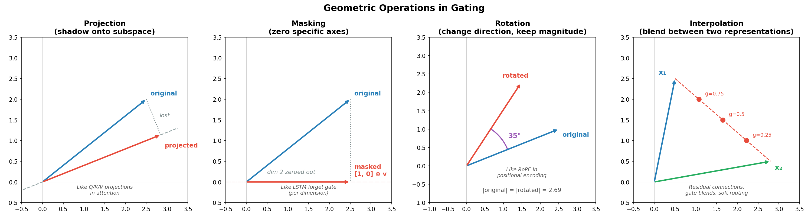

All gating is some combination of: scaling, masking, projection, rotation, interpolation.

> **Key insight:** The design skill is matching the geometric operation to the information flow requirement — identifying what functional behavior you need, then choosing the mathematical shape that provides it. This is the same pattern throughout ML: shape determines purpose.

---

<br>

## 🔧 Appendix: Diagnosing and Fixing Training Problems

### Reading the Loss Curve

| Symptom | Likely Cause | Action |
|---------|-------------|--------|
| Loss plateaus early, stays flat | Saddle point or dead gradients | Increase learning rate, add momentum, try Adam |
| Loss drops then hits a ceiling | Network too small or learning rate problem | Temporarily make network bigger; try LR schedule; check data quality |
| Loss oscillates wildly | Learning rate too high | Reduce LR; use adaptive optimizer (Adam, AdaGrad) |
| Training loss drops, validation diverges | Overfitting | Regularization, dropout, data augmentation, early stopping |
| Loss is NaN or infinity | Exploding gradients | Gradient clipping, reduce LR, check weight initialization |

### The Toolkit

**Learning rate** — the single most important hyperparameter. Schedules (high → low) almost always beat fixed rates. Warmup (low → high → low) helps when early gradients from random weights are unreliable.

**Momentum** (typically 0.9) — converts gradient descent from a ball rolling with friction into one rolling with inertia. Smooths noise, accelerates through consistent slopes, carries through flat regions.

**Adam** — combines momentum with adaptive per-parameter learning rates. Default choice for most problems. Tradeoff: can converge to sharper minima than SGD with momentum, which can hurt generalization. Some practitioners use Adam early, then switch to SGD for final training.

**Gradient clipping** — safety valve, not a fix. If you need aggressive clipping, something else is wrong.

**Batch/layer normalization** — reshape the loss landscape itself. Smooth the surface, reduce severity of valleys and plateaus. Neither is universal: batch norm breaks with small batches and sequential data; layer norm assumes all features should have similar scale. Both trade representational freedom for trainability. Usually worth it. Not always.
